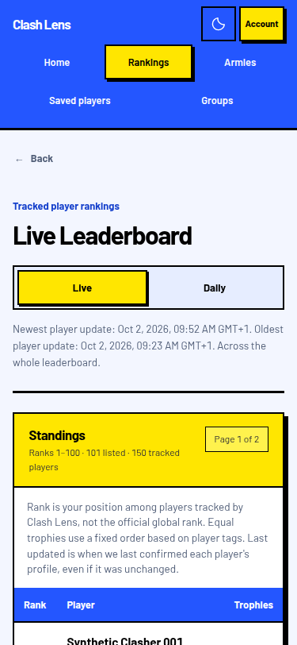
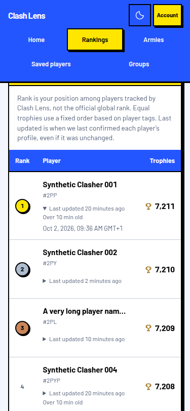
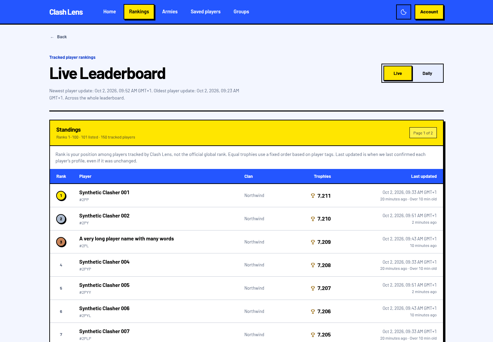
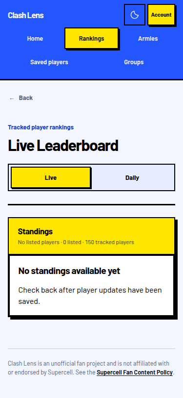
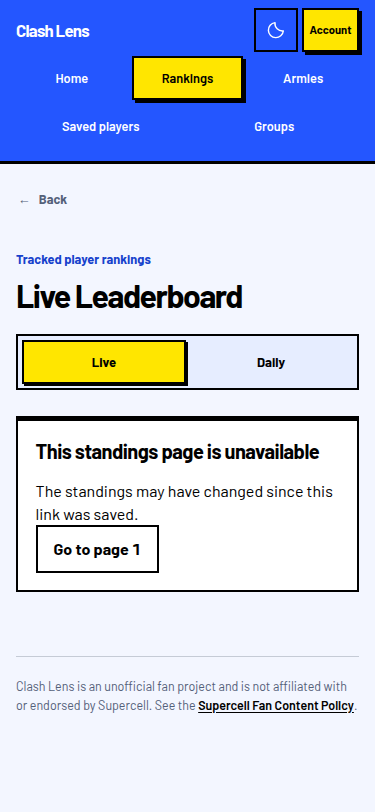

# Live Leaderboard clarity checks

Checked October 2, 2026 on `fm/cl-lb-polish`.

The page now names the Live Leaderboard, explains tracked-player Rank and the
fixed tag-based order for equal trophies, and labels the newest and oldest
player updates across the whole board. Each live row shows its own confirmation
time, relative age and an old-data label beyond ten minutes. At phone widths,
the age stays under the name and a native expandable control reveals the full
timestamp. The timestamp is included in the server-rendered HTML.

Empty standings show a message without a table or pagination. A missing page
after page one retains its HTTP 404 status and offers page one in the same view.
Daily recovery links preserve the selected season and day. Listed and tracked
player counts are distinct. No ordering, collection or player freshness rules
changed. Relative ages use the saved response age and update on navigation or
reload; this change adds no automatic refresh.

## Results

- `npm test` in `website`: type checking, lint, formatting and all 474 unit tests
  passed. The seven new route tests execute the real loader and render its HTML.
  Running them against the original route reproduced five failures; all seven
  passed after restoring the change.
- `npm run build:verify`: the production build and browser-secret boundary
  check passed. The build still reports the existing mixed static/dynamic import
  warning for `client-address.server.ts`.
- Three targeted Playwright tests passed against the built website with sample
  backend responses: 375 px update visibility and expansion, out-of-range recovery,
  and no serious or critical accessibility findings on the leaderboard.
- Chrome inspection at 375 × 812 and 1440 × 1000 used `chrome-devtools-axi`.
  All 100 phone rows had visible update controls; the document was 375 px wide
  and the table 339 px wide. Opening a timestamp introduced no sideways scroll.
  Space toggled the control without opening the player link. Desktop document
  width was 1440 px. Empty data rendered zero tables and no page controls.

The browser used the real built routes, server, response mapping and assets.
An in-memory replacement for the private API supplied 101 synthetic listed
players, 150 tracked players, different confirmation times, long names, empty
data and HTTP 404 responses. It made no real Clash requests. Screenshots below
show this sample data, not production data.

## Limits and unrelated findings

The full browser suite with the Python/database stack was not run because
Podman is absent here. The three browser checks above used
`CLASHLENS_E2E_EXTERNAL_STACK=1` against the isolated sample server. Physical
phones, JavaScript-disabled browsers, Safari, Firefox and production were not
checked. No deployment occurred.
Commands ran under the available Node 22.23.2 rather than the declared Node 24.
Installing the existing lockfile reported two moderate and one high dependency
vulnerabilities; dependency updates are outside this task.

The change replaces the old empty-table and generic missing-page presentation.
Most added lines are regression tests and evidence; there is no obsolete domain
code to delete. The table remains shared with the existing daily view.

## Screenshots

Phone heading and explanation, 375 × 812:

Phone rows with the first timestamp expanded, 375 × 812:

Desktop heading and rows, 1440 × 1000:

Empty standings, 375 × 812:

Out-of-range recovery, 375 × 812:

